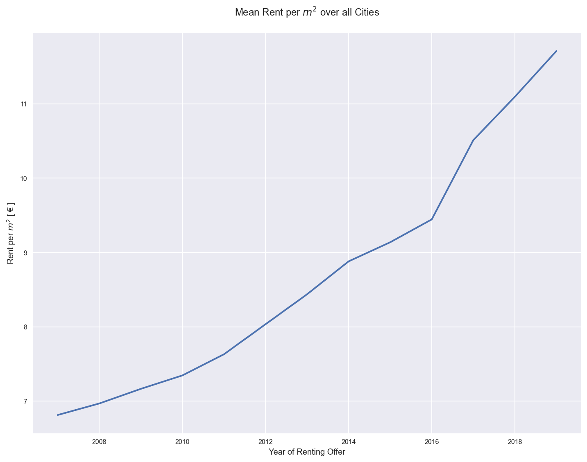

# German_Apartment_Rental
Udacity Data Scientist Nanodegree Project 1

# Motivation
I found this [record](https://www.kaggle.com/corrieaar/apartment-rental-offers-in-germany) from Corrie Bartelheimer on kaggle and I am really curious what information I can find out.

# Datasets
Later I asked Immoscout24 for an API access to download additional data. Instead an API access
they provided a complete dataset of germen housing prices over the last 15 years.
This dataset is used for the analysis.

# Collaboration
Therefore it is a Udacity project, there is no collaboration needed.

# Files
The DataAnalysisComplete.ipynb handles the the hole analysis from
gathering - understanding - cleaning - modeling and evaluation.

All other file in the repository are trial and error and not part of the
Data analysis.

In the Regression.ipynb I try dome regressions to fill missing values.
Unfortunately this regressions are not used, because the $r^2" score shows me that
only 40% of information was available to explain the values.
